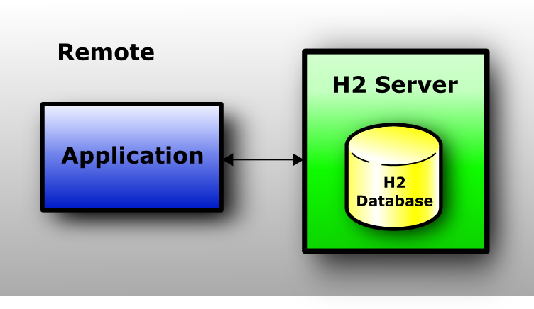

## 笔记的记录

1. 笔记很重要
1. 每天记笔记
1. 晚上下班前总结笔记
1. 第二天上班前复习笔记
1. 每周最后一天总结当周笔记
1. 把每周的笔记分类归档
1. 12447

## 个人特点

1. 有实力，肯钻研；喜创造，肯实干

## TODO

1.  学习spring security时梳理http的安全认证
1. spring cache redis 实现
1. spring mvc mock
1. 会员idhbase分区设计
1. 打印二叉树算法
1. 日志框架梳理，如何实时更新日志级别 目标快速使用
1. 单元测试覆盖开发配置
1. mybatis 源码解读
1. spring-mybatis/spring-redis
1. spring事务
1. ssh 隧道代理
1. java 日期操作


## 2019-06-30

### ssh  隧道代理

#### 环境

A 拥有`192.168.56.2/24`和`192.168.176.2/24`2个IP

B 有`192.168.176.1/24` 一个IP并且与A的`192.168.176.2/24`处于一个网络内

#### 本地代理远程端口

##### 1. A建立隧道

```shell
ssh root@192.168.176.1 -L 192.168.56.2:9906:192.168.176.1:3306 -N -f
```

> -L 本地代理
>
> 可以有2种形式，ip:port / socket file
>
>      -L [bind_address:]port:host:hostport
>      -L [bind_address:]port:remote_socket
>      -L local_socket:host:hostport
>      -L local_socket:remote_socket
>    
>      -L 9906:192.168.176.1:3306 默认绑定本机127.0.0.1
>      -L 127.0.0.1:9906:192.168.176.1:3307
>      -L localhost:9906:192.168.176.1:3307
>    
>      -L :9906:192.168.176.1:3307 默认绑定本机的所有网络接口"*"
>      -L *:9906:192.168.176.1:3307 
>    
>      -L 192.168.56.2:9906:192.168.176.1:3306
> -N 只代理，不连接到远程服务器
>
> -f 后台运行
>
> -N -f 通常一起用

本机主机(192.168.56.2)ssh 启动一个进程（processAA）

1. 在应用层监听9906端口
1. 用本机随机端口与远程192.168.176.1:22 建立TCP长连接

远程主机(192.168.176.1)ssh监听进程（processBA）在 接收到192.168.56.2 的ssh连接请求后

1. 启动一个新的进程（processBB）处理192.168.56.2的ssh连接

##### 2. 连接主机A上的隧道

```
mysql -h192.168.56.2 -P9906 -uzhanfeng.zhang -p
```

> mysql 连接的是192.168.56.2:9906端口，ssh会把数据forward到192.168.176.1:3306

本机主机(192.168.56.2)mysql 启动一个进程（processAC）

1. 用本机随机端口，与本机192.168.56.2:9906建立TCP连接
1. mysql 把数据发送给本机（192.168.56.2:9906）的ssh进程（processAA），ssh进程（processAA）把把数据发送给远端的192.168.176.1:22

远程主机(192.168.176.1)的ssh进程（processBB）收到请求后

1. 用本机的随机端口与本机的3306（192.168.176.1:3306）建立连接（**此步并没有建立新的进程**）
1. ssh进程（processBB）解密数据后转发给192.168.176.1:3306（有本机的mysqld启动进程监听）

#### 远程主机代理本地端口

##### 使用场景

B 处于内网，外网的用户无法与B建立TCP连接

A 处于公网，B可以与A建立TCP连接，让A代理自己。这样**任何一个可以访问A（可以通过公网/也可以是A的同局域网）的主机C可以通过A与B通信**。

A 拥有`192.168.56.2/24`和`192.168.176.2/24`2个IP

B 有`192.168.176.1/24` 一个IP并且与A的`192.168.176.2/24`处于一个网络内

这里假设`192.168.56.2/24`是公网段，B没有公网，让A代理自己。

##### 1. B主机上建立隧道

```shell
ssh -f -N -R 192.168.56.2:9906:192.168.176.1:3306 root@192.168.176.2
# 指定了IP(192.168.56.2) 也没用，A主机依旧只监听127.0.0.1:9906
```

##### 2. 连接A主机上的隧道

```shell
mysql -h127.0.0.1 -P9906 -uzhanfeng.zhang -p
```

#### ssh 隧道更广泛的形式

在A主机上执行一下命令表示通过bhost连接到chost:chostport。

> 其中只有A到bhost的连接是加密的。

```shell
ssh -f -N -L [bind_address:]port:chost:chostport root@bhost
ssh -g -f -N -L forwardingPort:targetIP:targetPort user@sshServerIP
```

> 上面2中形式隧道一旦建立，本地端口就只能forwarding到固定的远程端口(targetIp:targetPort)

#### ssh 本地端口动态forwarding

```shell
ssh -D [bind_address:]port root@bhost 
# 通过bhost动态连接到需要访问的远程主机，这样一个ssh隧道即可翻墙
# 本机监听的port可接受socks4/socks5连接
```


### SSL/TLS

Secure Socks Layer/Transport Layer Security


### 数字证书

#### 证书如何认证 

如何链式认证的？

证书中包含数据

1. 证书持有人的一些基本信息（Subject Name）如：Country or Region/Location/Organization/Common Name
1. 证书持有人的public key
1. 证书的数字签名
1. 证书的签发者（Issuer Name）信息，如：Country or Region/Organization/Common 

你验证对方的身份时，对方会把他的整个数字证书链（一直到root certificate）发送给你

**整个证书链 CA(root certificate) -> CA1 -> 你的证书。验证时从你的证书开始，用CA1证书中的public key 来验证你证书的有效性，然后递归向上，一直验证到根证书的有效性。**


#### 证书如何吊销

首先明白一点，CA发出去的证书是不能收回的。所以在**验证证书有效性的最后一步，会检查证书是不是被吊销了**。证书作废列表（CRL - certificate revoke list,OCSP - **O**nline **C**ertificate **S**tatus **P**rotocol）是有CA通过数字证书体系（PKI - public key infrastruture)下发的。有

- 用户端主动拉取/还是CA下发？
  - CRL 协议已被OCSP替代 
- 无网络的情况？

##### OCSP协议流程

1. [Alice与Bob](https://zh.wikipedia.org/wiki/愛麗絲與鮑伯)使用Carol颁发的数字证书。该场景中Carol是[证书颁发机构](https://zh.wikipedia.org/wiki/证书颁发机构)（CA）；
1. Alice向Bob发送其由Carol颁发的数字证书，并发出请求创建连接的申请；
1. Bob担心Alice的私钥已经泄露，因此向Carol发送“OCSP请求”消息并包含Alice的数字证书序列号；
1. Carol的OCSP响应端从Bob发送的消息中获取数字证书的序列号，并在CA数据库中查找该数字证书的状态；
1. Carol向Bob发送由其私钥加密的消息“OCSP响应”，并包含证书状态正常的信息；
1. 由于Bob事先已经安装了Carol的数字证书，因此Bob使用Carol的公钥解密消息并获取到Alice的数字证书状态信息；
1. Bob决定与Alice进行通信。

## 2019-06-28

### 软路由

#### newifi3 

1. download breed https://breed.hackpascal.net/
1. 刷入breed
   1. 开启ssh 在浏览器中输入 http://192.168.99.1/newifi/ifiwen_hss.html 
   1. 下载**newifi-d2-jail-break.ko**，cp到U盘
   1. U盘插入路由器，cd /mnt/sda1; cp newifi-d2-jail-break.ko /tmp; cd /tmp; insmod  newifi-d2-jail-break.ko
1. 进入breed，备份eeprom
   1. 拔掉电源，然后按住 Reset 键不放，接通路由电源，等6秒后再松开 Reset 键
   1. 浏览器输入192.168.1.1
   1. 固件备份->EEPROM
1. 刷入LEDE
   1. 拔掉电源，然后按住 Reset 键不放，接通路由电源，等6秒后再松开 Reset 键
   1. 浏览器输入192.168.1.1
   1. 恢复出厂设置->固件类型 选择 `Config区（公版）`->执行
   1. 固件更新->固件 选择 LEDE-*.bin ->上传
   1. 刷机完成后 看lede中的说明 登陆到具体的console192.168.1.1 root/admin

### ~~证书如何认证~~

### ~~如何回收证书~~

### 加密算法

#### 对称加密

速度快/密钥分发问题严重

- DES

#### 非对称加密

private key 自己私有/public key 随意分发。私钥加密->公钥解密 or 公钥加密->私钥解密

由已知的公钥**几乎不可能**推导出私钥

非对称加密**很慢，不适合**加密大数据

主要用于**数字签名**/**对称密钥交换**

- RSA
- ECC

#### 数字摘要

Message Digest 

y=f(x) x-可变长度的输入；y-固定长度的输出（指纹/数字摘要）

不同明文的摘要相同的概要是非常非常小的；而同样明文其摘要必定一致；不可逆；

- MD5
- SHA-1

## 2019-06-27

### md5

message digest algorithm 信息摘要算法

sha128/sha256

### 数字证书

digital certificate / public key certificate

### 数字签名

digital signature

### CA

Certificate authority 证书授权中心

root certificate 根证书

> 根证书以下的证书需要依赖根证书证明其有效性，根证书自己证明自己的有效性。

~~CA 颁发出去的证书如何收回~~


## 2019-06-26

### mybatis 

#### 配置如何变成可执行代码

##### 如何实现代理


#### 如何把对象传入sql

#### 如何把结果ResultSet变成对象


### ~~ssh  隧道代理~~


### 字节序

also see https://blog.erratasec.com/2016/11/how-to-teach-endian.html

计算机内存以byte为最小寻址单位，内存地址是从小到大排序的。8位宽的计算机每个内存的地址如下

```
0 1 2 4 5 6 7 8 9 ... 15 16 ... 254 255
```

一共可以寻址256个byte的空间地址

假如int类型用32bit（也就是4个byte）来表示 。0x12345678（十进制305419896）在内存中可以以以下2种方式存储

| 内存地址 | 0    | 1    | 2    | 3    |
| -------- | ---- | ---- | ---- | ---- |
| 存储值   | 12   | 34   | 56   | 78   |

| 内存地址 | 0    | 1    | 2    | 3    |
| -------- | ---- | ---- | ---- | ---- |
| 存储值   | 78   | 56   | 34   | 12   |

第一种便是大端序；第二种是小端序。

#### 大端序

some RISC big-endian CPU

人类的阅读顺序/网络序/文件序/Java

int计算方法：`val = buf[offset]<<24 | buf[offset+1]<<16 | buf[offset+2]<<8 | buf[offset+3]`

#### 小端序

x86 little-endian CPU

计算机内部序/C/C++

int计算方法：`val = buf[offset] | buf[offset+1]<<8 | buf[offset+2]<<16 | buf[offset+3]<<16`

##### 为什么会有小端序

计算机电路先处理低位字节，效率比较高，因为计算都是从低位开始的。所以，计算机的内部处理都是小端字节序。

计算机处理字节序的时候，不知道什么是高位字节，什么是低位字节。它只知道按顺序读取字节，先读第一个字节，再读第二个字节

## 2019-06-22

### mybatis

#### 打印jdbc 日志

1. 指定 MyBatis 增加到日志名称的前缀。注意`.`不能省略

   ```xml
     <settings>
       <setting name="logPrefix" value="mybatis."/>
     </settings>
   ```

1. 日志中添加debug级别的logger

   ```xml
     <logger name="mybatis" level="debug" additivity="false">
       <appender-ref ref="STDOUT"/>
     </logger>
   ```

## 2019-06-21

### H2

需求：

1. 单元测试

   > jdbc:h2:mem:db_test

1. 测试时偶尔查看DB内容

   1. 启动H2 Server

      > brew services run h2

   1. 测试jdbc url `jdbc:h2:tcp://localhost/mem:db_test`

   > 在测试jvm内启动server行不通，若jvm打断点，server的线程不能接受连接请求

   > 外部启动H2 server的方式也行不通，遇到`INIT=RUNSCRIPT FROM 'classpath:com/feng/learn/dao/db_blog.sql'`文件定位问题

   > 直接本地启动mysql，并导入建表语句，然后开启UT

1. MySQL 模式

   > jdbc:h2:mem:db_test;MODE=MySQL
   >
   > jdbc:h2:tcp://127.0.0.1:3342/mem:db_test;MODE=MySQL

1. 多个jvm共用一个db，开启自动模式

   > jdbc:h2:/tmp/db_test;AUTO_SERVER=TRUE

#### 3种模式

> Server Mode 必须要先启动一个H2 Server。
>
> `jdbc:h2:tcp://127.0.0.1:3342/mem:db_test;MODE=MySQL ` 只是告诉client去连位于`tcp://127.0.0.1:3342`的H2 Server，并使用内存的数据库。

1. Application 可以直连H2 Database.
1. Application 也可以通过TCP/IP连接到H2 Server, H2 Server 直连H2 Database.
1. Mixed模式

##### Embedded Mode

In embedded mode, an application opens a database from within the same JVM using JDBC.

##### Server Mode

When using the server mode (sometimes called remote mode or client/server mode), an application opens a database remotely using the JDBC or ODBC API.

##### Mixed Mode

The mixed mode is a combination of the embedded and the server mode. The first application that connects to a database does that in embedded mode, but also starts a server so that other applications (running in different processes or virtual machines) can concurrently access the same data. The local connections are as fast as if the database is used in just the embedded mode, while the remote connections are a bit slower.

#### 2种存储方案

##### in-memory

1. `jdbc:h2:mem:[databaseName]`

   > embedded mode
   >
   > jdbc:h2:mem:db_test
   >
   > jdbc:h2:mem:   	省了databaseName时为private 只容许一个connection

1. `jdbc:h2:tcp://<server>[:<port>]/[<path>]<databaseName>`

   > server mode
   >
   > jdbc:h2:tcp://127.0.0.1:3342/mem:db_test

##### persistent

1. `jdbc:h2:[file:][<path>]<databaseName>`

   > embedded mode
   >
   > jdbc:h2:./db_test
   >
   > jdbc:h2:file:/tmp/db_test

1. `jdbc:h2:tcp://<server>[:<port>]/[<path>]<databaseName>`

   > server mode
   >
   > jdbc:h2:tcp://127.0.0.1:3342/./db_test
   >
   > jdbc:h2:tcp://127.0.0.1:3342/tmp/db_test
   >
   > jdbc:h2:tcp://127.0.0.1:3342/~/db_test

#### 连接字符串参数

- `jdbc:h2:<url>;INIT=RUNSCRIPT FROM '~/create.sql'`

  > jdbc:h2:file:~/sample;INIT=RUNSCRIPT FROM '~/create.sql'\;RUNSCRIPT FROM '~/populate.sql'

- `jdbc:h2:~/test;MODE=DB2` or  SQL statement `SET MODE DB2` : 兼容模式，H2兼容多种数据库，该值可以为：DB2、Derby、HSQLDB、MSSQLServer、MySQL、Oracle、PostgreSQL

- `jdbc:h2:/data/test;AUTO_SERVER=TRUE`：启动自动混合模式，允许开启多个连接。

  > AUTO_SERVER=TRUE 只支持embedded mode 的persistant
  >
  > 只有一种url：`jdbc:h2:/data/test;AUTO_SERVER=TRUE`

  > 该参数不支持在内存中运行模式

  > 地址必须是不同的进程看到的是同一个文件，
  >
  > 绝对地址`/data/test`
  >
  > 相对地址`~/db_test`可以；`jdbc:h2:./db_test` 不行

- `jdbc:h2:/data/sample;IFEXISTS=TRUE` h2启动时数据库必须存在

- `jdbc:h2:~/test;DB_CLOSE_DELAY=-1`要求最后一个正在连接的连接断开后，不要关闭数据库

- AUTO_RECONNECT=TRUE：连接丢失后自动重新连接





## 2019-06-18

1. EmbeddedDb integrate with mybatis
1. String 注入变Resource？

## 2019-06-17

### Data Access Object

#### 接口耦合

数据访问层通过接口与应用的其他部分建立耦合

1. 低耦合-应用无需知道数据访问层的具体实现是什么（可以是SpringJDBC/MyBatis/Hibernate/JPA/JTO)

   > 应用可以以最小的影响更换数据访问层的具体实现

#### 嵌入式DB

Embedded-datasource 可以随应用一起启动，每次启动可以初始化数据环境，方便开发/测试。


## 2019-06-14

### Spring Task

#### TaskSheduler

`@EnableScheduling` 可以让spring container 识别bean中的`@Scheduld`注解。

> Note: @EnableScheduling applies to its local application context only, allowing for selective scheduling of beans at different levels. Please redeclare @EnableScheduling in each individual context, e.g. the common root web application context and any separate DispatcherServlet application contexts, if you need to apply its behavior at multiple levels.

`@Scheduled`  注解的task默认在哪些线程中执行？

1. a unique org.springframework.scheduling.TaskScheduler bean in the context
1. a TaskScheduler bean named "taskScheduler"
1. a unique java.util.concurrent.ScheduledExecutorService bean in the context
1. a ScheduledExecutorService named "scheduledExecutorService"
1. a local single-threaded default scheduler 默认的单线程

#### TaskExecutor/@Async

@Async 可以指定在哪个线程池中执行被注解的任务方法

>  matching the qualifier value (or the bean name) of a specific Executor or TaskExecutor bean definition

@Async 注解的任务默认执行线程：

1. a unique org.springframework.core.task.TaskExecutor bean in the context

1. an java.util.concurrent.Executor bean named "taskExecutor" 

   >  TaskExecutor is a sub interface of Executor

   > ThreadPoolTaskScheduler is sub class of TaskExecutor

1. a org.springframework.core.task.SimpleAsyncTaskExecutor

#### 案例解析1

```java
@Component
public class ComponentA implements IA{
    @Async
    @Override
    public void a() {
        System.out.println(Thread.currentThread() + ": Aa");
        b(); // 内部调用不走代理，所以b()是在当前线程中执行，而不是异步执行
    }
  	// 此@Async在`@EnableAsync(mode = AdviceMode.PROXY, proxyTargetClass = false)`配置下
    // 没有任何意义，外部只能看到IA接口提供的服务
    // a() invoke b() 内部调用，亦不会异步处理逻辑
    @Async
    public void b() {
        System.out.println(Thread.currentThread() +": Ab");
    }
}
```

```java
@Component
public class ComponentC {
    @Async
    public void a() {
        System.out.println(Thread.currentThread() + ": Ca");
        b(); // 内部调用不走代理，所以b()是在当前线程中执行，而不是异步执行
    }
    @Async
    public void b() {
        System.out.println(Thread.currentThread() + ": Cb");
    }
}
```

代理配置：`@EnableAsync(mode = AdviceMode.PROXY, proxyTargetClass = false)`

> 代理模式：对实现接口的类，生成基于接口的代理；没有实现接口的类，使用CGLIB生成基于类的子类代理。

1. ComponentA解析：对于实现接口的类，只要需要生成代理（如b方法上的@Asybc）。**会在spring 容器中对ComponentA生成代理bean，类型是接口IA的子类，而不是ComponentA的子类，注入的时候需十分注意。并且代理Bean中只能看到接口IA的方法，对于ComponentA所有其他非接口方法，在代理Bean中是不存在的**。
1. ComponentC解析：没有实现接口，使用CGLIB对ComponentC生成子类代理bean。也就是说在spring容器中的Bean是ComponentC的子类。在ComponentC外部调用a()/b()时，都是async执行。

代理配置：`@EnableAsync(mode = AdviceMode.PROXY, proxyTargetClass = true)`

> Note that setting this attribute to true will affect all Spring-managed beans requiring proxying

> 注意spring在mode = AdviceMode.PROXY下的proxyTargetClass配置是全局配置，会影响所有使用AdviceMode.PROXY代理的代理配置。也就是说，若你的事务Transaction/缓存Cache使用AdviceMode.PROXY代理模式，那他们的proxyTargetClass也是true

> proxyTargetClass=true 全部使用基于CGLIB代理，不关心类有没有实现接口。

1. ComponentA解析：使用CGLIB对ComponentA生成子类代理bean。也就是说在spring容器中的Bean是ComponentA的子类，**那也是IA的子类**。在ComponentA外部调用a()/b()时，都是async执行。
1. ComponentC解析：使用CGLIB对ComponentC生成子类代理bean。也就是说在spring容器中的Bean是ComponentC的子类。在ComponentC外部调用a()/b()时，都是async执行。

## 2019-06-13

### 二叉搜索树

#### delete

```c++
TREE_DELETE(T, n)
	if n.right!=NIL
		// 右子树存在
		n.right.parent=NIL
		// 找到右子树中的最小节点
		replace=TREE_MINIMUM(n.right)
		
		// 移动n的左孩子到最小节点的左节点
		repalce.left=n.left
		if n.left!=NIL
			n.left.parent=replace
			n.left=NIL
		
		// 平衡树算法
		if replace.parent!=NIL // replace!=n.right
			// 移动replace的右子树到replace父节点的左孩子节点 
			replace.parent.left=replace.right
			if replace.right!=NIL
				replace.right.parent=replace.parent
				replace.right=NIL
			// 移动n节点的右子树到replace的右子树节点
			replace.right=n.right
			n.right.parent=replace
			n.right=NIL
     	replace.parent=NIL // replace.parent 置空
	else replace=n.left
	
	// 以replace 替换n
	replace.parent=n.parent
	if n.parent==NIL // n是根节点
		T.root=replace
	else if n=n.parent.left
		n.parent.left=replace
	else n.parent.right=replace
```

```c++
// v->u v替换u
// u节点不能为NIL，v可以为NIL
// 不用关心u节点的p指针，树是由上向下访问的
// 但是要处理v父节点的指针问题
TRANSPLANT(T, u, v)
	if u.p==NIL
		T.root=v
	else if u=u.p.l
		u.p.l=v
	else u.p.r=v
	if v!=NIL
		if v.p==NIL
		else if v=v.p.l
			v.p.l=NIL
		else v.p.r=NIL
		v.p=u.p // v节点的p指针指向u的父节点
```

```c++
TREE_DELETE(T, n)
	if n.l==NIL
		TRANSPLANT(T, n, n.r)
	else if n.r==NIL
		TRANSPLANT(T, n, n.l)
  else
    y=TREE_MINIMUM(n.r)
    if y.p!=n
    	// 平衡一下树 
    	TRANSPLANT(T, y, y.r)
      y.r=n.r
      n.r.p=y
    TRANSPLANT(T, n, y)
    y.r=n.l
    n.l.p=y
```

## 2019-06-11

### 二叉搜索树

#### insert

```c++
TREE_INSERT(T, n)
	x=T.root
	y=NIL
	while x!=NIL
		y=x
		if x.key>=n.key
			x=x.left
		else x=x.right

	n.parent=p
	if y==NIL
		T.root=n
	else if y.key>=n.key
		y.left=n
	else
		y.right=n
```

### mysql

#### datetime与timestamp的区别

- 时区：timestamp 把mysql服务器的时区转换成UTC然后存储，取出时反向转换。存储的是UTC时间
- 占用字节：timestamp 4+(0~3)/datetime 5+(0~3)
- 表示范围：timestamp '1970-01-01 00:00:01' UTC~'2038-01-19 03:14:07' UTC / datetime '1000-01-01 00:00:00' ~'9999-12-31 23:59:59'

## 2019-06-07

### 科学上网

1. ss/ssr
1. v2ray
1. wireguard


## 2019-06-06

### mysql

```sql
create table t2 like t1

create table t3 as (select * from t4)
```

### HBase

#### table

表是需要在schema中预先定义的，声明时需要指定表名(table name)和列族(Column Family)

```
create ‘<table name>’,’<column family>’
```

#### row

每一行都有一个行健，行健是未解释的字节，按字母顺序自然排序。

#### Column Family

列族必须是由**可打印字符组成**。

#### Cell

由{row key, column( =<family> + <label>), version} 唯一确定的单元。cell 中的数据是没有类型的，全部是字节码形式存储。

#### 实践操作

1. hbase shell
1. help '${commond}'
1. list 列出所有的表
1. desc 'table_1' 显示表描述
1. `get '${table}', ${row}'`

## 2019-06-05

### ES

### filter 用作过滤

在filter context下执行，不用计算score，可以加快查询。

```json
{
  "query": {
    "constant_score": {
      "filter": {
        "${conditions}"
      }
    }
  }
}
```

### 分页查询

1. from, size
1. scroll
1. search_after

`form,size`可以随机访问任何一页的数据，scroll/search_after只能一页一页向后访问。

- from,size 在数据量大时（很多分页），消耗很高。能使用search_after时，推荐使用search_after。

- scroll 并不适合用来做实时搜索，而更适用于后台批处理任务，比如群发。

- search_after不能自由跳到一个随机页面，只能按照 sort values 跳转到下一页

#### scroll 查询

https://www.elastic.co/guide/en/elasticsearch/reference/6.8/search-request-scroll.html

以游标方式取回大量【全部】数据。

1. 发送search请求，**返回数据和_scroll_id**

   > 注意不要忽略处理第一步返回的数据

1. 发送scroll请求（携带**最新**的`_scroll_id`，可能是第一步的`_scroll_id`,也可能是此步骤返回的`_scroll_id`)，请求会**返回数据和新的_scroll_id**

1. 处理第二步返回的数据，然后以第二步返回的 **新的_scroll_id** 重复第二步。若第二步返回的**结果为空**（the `hits` array is empty），跳出循环。

>The initial search request and each subsequent scroll request each return a `_scroll_id`, which may change with each request — only the most recent `_scroll_id`should be used.

> Scroll requests have optimizations that make them faster when the sort order is `_doc`. If you want to iterate over all documents regardless of the order, this is the most efficient option:

```
POST yh_member_tag_idx/yh_member_tag_type/_search?scroll=1m
{
	"size": 2,
  "sort": [
    "_doc"
  ],
  "_source": "{}", 
  "query": {
  	"${conditions}"
  }
}

POST /_search/scroll
{
    "scroll" : "1m", 
    "scroll_id" : "${第一步返回/此请求返回的最新 的_scroll_id}" 
}
```

#### search_after 查询

**使用search_after 必须有一个全局唯一的字段（相当于mysql的主键）用作排序**，可用于替代`from,size`分页请求。

官方推荐使用`_uid`来排序。

> A field with one unique value per document should be used as the tiebreaker of the sort specification. Otherwise the sort order for documents that have the same sort values would be undefined. The recommended way is to use the field `_uid` which is certain to contain one unique value for each document.

1. 发送_search 请求，返回分页数据，找到最后一个数据的sort的值，处理返回数据

   > 请求中必须有sort字段

1. 发送_search 请求（与第一步相同的条件，可以更改页面大小），此次请求中携带最新的sort值（可以是第一步中的sort值/也可以是本次请求中返回的分页数据中最后一个数据的sort值），返回分页数据，处理返回数据。

1. 重复第二步，直到返回数据为空。

> 若已知被排序字段的值域，可以省略第一步，直接重复2-3步。

```http
POST yh_member_tag_idx/yh_member_tag_type/_search
{
  "size": 10,
  "sort": [
    "_uid"
  ],
  "_source": "{}", 
  "query": {
    ${conditions}
  }
}

POST yh_member_tag_idx/yh_member_tag_type/_search
{
  "size": 10,
  "sort": [
    "_uid"
  ],
  "_source": "{}", 
  "search_after":[166050],
  "query": {
    ${conditions}
  }
}
```


### mysql create unique index

```sql
create table t(
id int,
id2 int,
primary key(`id`),
unique key `t_id2` (id2)
)

create table t1(
id int,
id2 int,
primary key(`id`),
unique index `t2_id2` (`id2`)
)
```

### mysql 数据类型

1. int 类型后面的数字`int(11)` 表示**最大显示宽度**。

   > 一个int类型占用4个byte
   >
   > 可存储范围[-2147483648, 2147483647]
   >
   > 无符号`unsigned` 表示范围[0, 4294967295]
   >
   > 默认有符号int的最大显示宽度为`11`
   >
   > 默认无符号int的最大显示宽度为10

1. varchar 类型后面数字`varchar(256)`表示可存储的字符（一个中文算一个字符）长度

#### mysql 日期类型

1. date 固定格式`2019-06-05`
1. time 格式`09:29:36`
1. timestamp 格式`2019-06-05 09:30:32`
1. datetime 格式`2019-06-05 09:30:32`

| 类型      | byte    | 格式                  | 最小值                    | 最大值                    | 零值表示              |
| --------- | ------- | --------------------- | ------------------------- | ------------------------- | --------------------- |
| date      | 3       | 'YYYY-MM-DD'          | '1000-01-01'              | '9999-12-31'              | '0000-00-00'          |
| time      | 3+(0~3) | 'hh:mm:ss''           | '-838:59:59'              | '838:59:59'               | '00:00:00'            |
| datetime  | 5+(0~3) | 'YYYY-MM-DD hh:mm:ss' | '1000-01-01 00:00:00'     | '9999-12-31 23:59:59'     | '0000-00-00 00:00:00' |
| timestamp | 4+(0~3) | 'YYYY-MM-DD hh:mm:ss' | '1970-01-01 00:00:01' UTC | '2038-01-19 03:14:07' UTC | 00000000              |

> time/datetime/timestamp 在msyql5.6.4及以后版本采用固定子节+0到3个子节（表示秒精度）
>
> datetime/datetime(0) 使用5+0bytes;
>
> datetime(1)/datetime(2) 使用5+1bytes
>
> datetime(3)/datetime(4) 使用5+2bytes
>
> datetime(5)/datetime(6) 使用5+3bytes
>
> time/timestamp 类似

> MySQL converts `TIMESTAMP` values from the current time zone to UTC for storage, and back from UTC to the current time zone for retrieval

> Invalid `DATE`, `DATETIME`, or `TIMESTAMP` values are converted to the “zero” value of the appropriate type (`'0000-00-00'` or `'0000-00-00 00:00:00'`).

##### 自动初始化/更新

1. default current_timestamp
1. on update current_timestamp

> current_timestamp 可用 current_timestamp()/now()/current_timestamp(6)/now(6) 等替代。
>
> 注意now后面必须要有()；current_timestamp不必有()。

自动初始化/更新 可用于 `timestamp` 和 `datetime` 2个字段

```sql
Create Table: CREATE TABLE `t10` (
  `id` int(11) DEFAULT NULL,
  `ts` timestamp NULL DEFAULT NULL,
  `ts1` timestamp NULL DEFAULT CURRENT_TIMESTAMP,
  `ts2` timestamp NULL DEFAULT CURRENT_TIMESTAMP,
  `ts3` timestamp NULL DEFAULT CURRENT_TIMESTAMP ON UPDATE CURRENT_TIMESTAMP,
  `ts4` timestamp NULL DEFAULT CURRENT_TIMESTAMP ON UPDATE CURRENT_TIMESTAMP,
  `ds` datetime(6) DEFAULT CURRENT_TIMESTAMP(6) ON UPDATE CURRENT_TIMESTAMP(6),
  `ts5` timestamp(6) NULL DEFAULT CURRENT_TIMESTAMP(6) ON UPDATE CURRENT_TIMESTAMP(6),
  `ds2` datetime(4) DEFAULT CURRENT_TIMESTAMP(4),
  `ds3` datetime(5) DEFAULT CURRENT_TIMESTAMP(5) ON UPDATE CURRENT_TIMESTAMP(5),
  `ds5` datetime DEFAULT CURRENT_TIMESTAMP ON UPDATE CURRENT_TIMESTAMP
)
```

##### 相关函数

1. current_time()/CURTIME() 返回time
1. current_date()/CURDATE() 返回date
1. current_timestamp()/now() 返回timestamp
1. date()提取日期类型中的date数据`date(now())`返回`2019-06-05`
1. extract(year/[month/day/hour/minute/second] from 日期或时间字段) 从日期数据中提取指定属性的数据

#### mysql 默认值

mysql 的默认值如`id int default 0` **是不会校验null值的**，换句话说你主动可以插入null值。

default 的意义在于：插入时省略id这个字段时，会自动给你填充一个默认值。

## 2019-06-04

### mysql 事务

**很多sql实现中，每个sql语句自成一个事务，且一执行完成就提交。**

### mysql 完整性约束

完整性约束保证授权用户对数据库所做的操作不会破坏数据的一致性。

1. not null
1. unique
1. check (mysql 8.0.16 之前版本会ignore)

```sql
mysql> create table t3(
    -> id int auto_increment,
    -> name varchar(64) not null,
    -> gender tinyint(1) not null,
    -> primary key(`id`),
    -> unique key(`name`),
    -> check(gender in (0,1))
    -> );
```

###mysql int后面数字含义

| 类型      | 字节 | 最小值               | 最大值               |
| --------- | ---- | -------------------- | -------------------- |
|           |      | (带符号的/无符号的)  | (带符号的/无符号的)  |
| TINYINT   | 1    | -128                 | 127                  |
|           |      | 0                    | 255                  |
| SMALLINT  | 2    | -32768               | 32767                |
|           |      | 0                    | 65535                |
| MEDIUMINT | 3    | -8388608             | 8388607              |
|           |      | 0                    | 16777215             |
| INT       | 4    | -2147483648          | 2147483647           |
|           |      | 0                    | 4294967295           |
| BIGINT    | 8    | -9223372036854775808 | 9223372036854775807  |
|           |      | 0                    | 18446744073709551615 |

```sql
create table t4( 
	id int unsigned auto_increment, 
	id2 int NOT NULL default 0, 
	id3 int unsigned zerofill NOT NULL default 0, 
	id4 int zerofill NOT NULL default 0, 
	id5 tinyint, 
	id6 tinyint unsigned, 
	id7 smallint, 
	id8 smallint unsigned, 
	id9 bigint, 
	id10 bigint unsigned, 
	primary key(id), 
	unique key(id2) 
);

mysql> show create table t4\G
*************************** 1. row ***************************
       Table: t4
Create Table: CREATE TABLE `t4` (
  `id` int(10) unsigned NOT NULL AUTO_INCREMENT,
  `id2` int(11) NOT NULL DEFAULT '0',
  `id3` int(10) unsigned zerofill NOT NULL DEFAULT '0000000000',
  `id4` int(10) unsigned zerofill NOT NULL DEFAULT '0000000000',
  `id5` tinyint(4) DEFAULT NULL,
  `id6` tinyint(3) unsigned DEFAULT NULL,
  `id7` smallint(6) DEFAULT NULL,
  `id8` smallint(5) unsigned DEFAULT NULL,
  `id9` bigint(20) DEFAULT NULL,
  `id10` bigint(20) unsigned DEFAULT NULL,
  PRIMARY KEY (`id`),
  UNIQUE KEY `id2` (`id2`)
) ENGINE=InnoDB DEFAULT CHARSET=utf8mb4 COLLATE=utf8mb4_general_ci
```

观察以上建表语句和表格数据：

1. tinyint 类型带符号数范围[-128~127]，最大显示宽度为4；无符号数范围[0~255]，最大显示宽度为3
1. smallint/int/bigint 类似。

### ES 查询优化


### mysql

#### 连表查询总结

```
from r₁ natural join r₂
from r₁ join r₂ using (Aⱼ)
from r₁ join r₂ on r₁.Aᵢ=r₂.Aⱼ
```

以上3中形式的连表查询都可以使用left/right查询。

外连接查询是在**内连接查询的基础上加上额外的元组**形成结果集。

```
from r₁ natural left join r₂
from r₁ left join r₂ using (Aⱼ)
from r₁ left join r₂ on r₁.Aᵢ=r₂.Aⱼ
```

进一步抽象

可以划分为连接类型/连接条件

连接类型有：

1. [inner] join 等同与join（默认inner可以省略）
1. left [outer] join
1. right [outer] join
1. full [outer] join（mysql不支持）

连接条件有：

1. r₁ natural join r₂
1. r₁ join r₂ using (Aⱼ)
1. r₁ join r₂ on r₁.Aᵢ=r₂.Aⱼ

连接类型可以和连接类型自由组合

#### 连表查询

##### `ID`字段上取交集 r₁∩r₂


```sql
select *
from student as a natural join takes as t;

select * 
from student as s join takes as t using (`ID`); 
-- 注意 using 后面的()不能省略

select * 
from student as s join takes as t on s.ID=t.ID;

select * 
from student as s, takes as t 
where s.ID=t.ID;
```

##### `ID` 字段左查询/右查询


from r₁ left join r₂ on r₁.Aⱼ=r₂.Aᵢ

r1表中的元组会被**全部保留下来**，r₂中若无对应字段，结果关系中，r₂的字段会被置null；若r₂中有多个元组与r₁中的对应，结果关系中，**r₂的元组都会被保留下来**。

from r₁ right  join r₂ on r₁.Aⱼ=r₂.Aᵢ

右查询与座查询相反。

```sql
select *
from student as a
	natural left join takes as t;
	
select * 
from student as s
	left join takes as t using (`ID`); 

select * 
from student as s 
	left join takes as t on s.ID=t.ID;
```

##### 差集 r₁-r₂


from r₁ left join r₂ on r₁.Aⱼ=r₂.Aᵢ where r₂.Aᵢ is null

from 中左查询，where条件中过滤掉r₁和r₂的交集部分。

```sql
select  * 
from student as s 
	left join takes as t on s.ID = t.ID 
where t.ID=null;
```

##### 全集 r₁∪r₂

mysql 不支持full join 可以用**左连接union右连接**（union 会自动去重）


```sql
select * 
from student as s 
	left join takes as t on s.ID = t.ID
union
select * 
from student as s 
	right join takes as t on s.ID = t.ID;
```

##### 全集-交集

(r₁-r₂) ∪ (r₂-r₁)


```sql
select * 
from student as s 
	left join takes as t on s.ID=t.ID
where t.ID is null
union
select *
from student as s
	right join takes as t on s.ID=t.ID
where s.ID is null
```


#### 连表查询测试

##### 表及数据

```sql
create table t1( id int, name varchar(64) );
create table t2( id int, name varchar(64) );
insert into t1 values(1, 'Pirate'),(2, 'Monkey'),(3, 'Ninja'),(4, 'Spaghetti');
insert into t2 values(1, 'Rutabaga'),(2, 'Pirate'),(3, 'Darth Vade'),(4, 'Ninja'),(5, 'Ninja');
```

##### natural join

```sql
mysql> select * from t1 natural join t2;
Empty set (0.00 sec)
-- t1 与 t2 有2个字段同名
```

##### join using

```sql
mysql> select * from t1 join t2 using (`name`);
+--------+------+------+
| name   | id   | id   |
+--------+------+------+
| Pirate |    1 |    2 |
| Ninja  |    3 |    4 |
| Ninja  |    3 |    5 |
+--------+------+------+
3 rows in set (0.00 sec)

mysql> select * from t1 join t2 using (`id`);
+------+-----------+------------+
| id   | name      | name       |
+------+-----------+------------+
|    1 | Pirate    | Rutabaga   |
|    2 | Monkey    | Pirate     |
|    3 | Ninja     | Darth Vade |
|    4 | Spaghetti | Ninja      |
+------+-----------+------------+
4 rows in set (0.00 sec)
```

##### join on

```
mysql> select * from t1 inner join t2 on t1.name=t2.name;
+------+--------+------+--------+
| id   | name   | id   | name   |
+------+--------+------+--------+
|    1 | Pirate |    2 | Pirate |
|    3 | Ninja  |    4 | Ninja  |
|    3 | Ninja  |    5 | Ninja  |
+------+--------+------+--------+
3 rows in set (0.00 sec)
```

##### left join

```
mysql> select * from t1 left join t2 on t1.name=t2.name;
+------+-----------+------+--------+
| id   | name      | id   | name   |
+------+-----------+------+--------+
|    1 | Pirate    |    2 | Pirate |
|    3 | Ninja     |    4 | Ninja  |
|    3 | Ninja     |    5 | Ninja  |
|    2 | Monkey    | NULL | NULL   |
|    4 | Spaghetti | NULL | NULL   |
+------+-----------+------+--------+
5 rows in set (0.00 sec)
```

##### A-B

```
mysql> select * from t1 left join t2 on t1.name=t2.name where t2.name is null;
+------+-----------+------+------+
| id   | name      | id   | name |
+------+-----------+------+------+
|    2 | Monkey    | NULL | NULL |
|    4 | Spaghetti | NULL | NULL |
+------+-----------+------+------+
2 rows in set (0.00 sec)

```

##### A∪B

```sql
mysql> select * from t1 left join t2 on t1.name=t2.name
    -> union
    -> select * from t1 right join t2 on t1.name=t2.name;
+------+-----------+------+------------+
| id   | name      | id   | name       |
+------+-----------+------+------------+
|    1 | Pirate    |    2 | Pirate     |
|    3 | Ninja     |    4 | Ninja      |
|    3 | Ninja     |    5 | Ninja      |
|    2 | Monkey    | NULL | NULL       |
|    4 | Spaghetti | NULL | NULL       |
| NULL | NULL      |    1 | Rutabaga   |
| NULL | NULL      |    3 | Darth Vade |
+------+-----------+------+------------+
7 rows in set (0.00 sec)
```

##### A∪B - A∩B

```sql
mysql> select * from t1 left join t2 on t1.name=t2.name where t2.name is null
    -> union
    -> select * from t1 right join t2 on t1.name=t2.name where t1.name is null
    -> ;
+------+-----------+------+------------+
| id   | name      | id   | name       |
+------+-----------+------+------------+
|    2 | Monkey    | NULL | NULL       |
|    4 | Spaghetti | NULL | NULL       |
| NULL | NULL      |    1 | Rutabaga   |
| NULL | NULL      |    3 | Darth Vade |
+------+-----------+------+------------+
4 rows in set (0.00 sec)
```


## 2019-06-01

### 归类5月份学习笔记


## 2019-05-31

### mysql

#### where Aⱼ>some() / Aⱼ > all()

`Aⱼ>some()`  equals `Aⱼ>any()`

Aⱼ>some() 是和some中的所有值比较，只要有**一个**比较为真true便返回true。当some()为空时，返回false。

Aⱼ>all() 是和all中所有的值比较，所有比较全部为true时才会回true。当all()为空时，返回true。

#### mysql from 子查询

```sql
select dept_name, avg(salary) as avg_salary 
from instructor 
group by dept_name 
having avg(salary) > 42000;
-- equals to 
select dept_name, avg_salary 
from (select dept_name, avg(salary) 
      from instructor 
      group by dept_name) 
      as dept_avg(dept_name, avg_salary) --此处运用了as的重命名（把avg(salary) -> avg_salary）
where avg_salary > 42000;
```

#### mysql 标量子查询

返回**单个属性的单个值**（单个元组）的子查询称为 标量子查询。该子查询可以用在任何地方

```sql
select *, (select count(*) from instructor as i where i.dept_name = d.dept_name) as teacher_num 
from department as d;
-- equals
select * 
from department as d
	left join (select dept_name,count(*) 
             from instructor 
             group by dept_name) 
             as d_t(dept_name, teacher_num) on d.dept_name = d_t.dept_name;
```

#### mysql 子查询

**子查询返回的是一个关系，标量子查询也是。**

#### mysql 复制库

 ```
mysqldump demo -uroot --add-drop-table | mysql demo2 -uroot
 ```


### hbase 快速入门

#### hbase data model

1. table 数据存储在表中，table 由 rows 和 Column Family 组成

1. row 行由一个行健（row key）和一个或多个与其关联的列族（Column Family）组成。

   > row key 是按字母顺序排序

1. column family 列族存储一组列（column）和它们的值。

   > 表中的每row都有相同的column family，但给定的row可能不会再某些column family中存储任何内容

   > column family 一旦确定后，就不能轻易修改，因为它会影响到 HBase 真实的物理存储结构，但是列族中的列标识(Column Qualifier)以及其对应的值可以动态增删。

1. column 列由一个列族（column family）和一个列限定符（column qualifier）组成，它们由`:`（冒号）字符分隔

1. column qualifier 列限定符被添加到列族中，**以提供给定数据段的索引**。鉴于列族的`content`，列限定符可能是`content:html`，而另一个可能是`content:pdf`。

   >  虽然列族在创建表时是固定的，但列限定符是可变的，并且在行之间可能差别很大。

1. cell 单元格是有 行 + 列族 + 列限定符 共同确定，包含值和时间戳

   > mysql 的单元格是由 行 + 列就可以确定的，可以理解为2维存储
   >
   > hbase 的单元格是由 行 + 列 + 列限定符 确定，3维存储哦

```
create 'table_1', 'cf_1', 'cf_2'
desc 'table_1'

// put ‘table name’,’row ’,'Column family:column name',’new value’
put 'table_1','row_1','cf_1:1','value_1'
put 'table_1','row_1','cf_1:2','value_2'
put 'table_1','row_1','cf_2:1','value_3'


get 'table_1','row_1'
get 'table_1','row_1','cf_1','cf_2'
get 'table_1','row_1','cf_1:1'

```


#### HBase排序顺序

所有数据模型操作 HBase 以排序顺序返回数据。首先按行，然后按列族（ColumnFamily），然后是列限定符，最后是时间戳（反向排序，因此首先返回最新的记录）。


## 2019-05-30

### mysql

#### null值对聚集函数的影响

min(Aⱼ)/max(Aⱼ)/count(Aⱼ)/sum(Aⱼ)/avg(Aⱼ) 会忽略Aⱼ值为null的元组。

#### 嵌套子查询

```sql
select distinct(course_id) 
from section 
where semester='fall' 
	and year=2009 
	and course_id in (select distinct(course_id) 
    								from section 
    								where semester='spring' 
    								and year=2010
  );
```

#### where子句的 Aⱼ>some() /Aⱼ>all()

`>some()` 大于其中的某一个值

`>some()` / `<some()` / `>=some()` / `<=some()` / `=some()` /`<>some()`

`>all()` / `<all()` / `>=all()` / `<=all()` / `=all()` / `<>all()`

`=some()` equals `in()`

`<>some()` **not equals** `not in ()`

`=all()` **not equals** `in ()`

`<>all()` equals `not in ()`

```sql
select * 
from instructor 
where salary > some(select salary 
                    from instructor 
                    where dept_name='history'
);
-- 等价于下面的查询
select * 
from instructor 
where salary > (
	select min(salary) 
	from (select salary 
				from instructor 
				where dept_name='history'
	) as a
);
```


## 2019-05-29

### mysql

#### 连表查询

1. 笛卡尔积

   ```
   SELECT A₁,...,Aⱼ
   FROM r₁,...,rⱼ
   ```

1. 自然连接 NATURAL JOIN

   1. 自然连接会把2张表中的 **所有的具有相同名字的列** 做等值判断。
   1. FROM r₁ JOIN r₂ USING (A₁,A₂) 形式的连接可以自定义等值的列。

   ```
   SELECT A₁,...,Aⱼ
   FROM r₁ NATURAL JOIN r₂ ... NATURAL JOIN rⱼ
   
   // 下面的形式可以指定以哪些列做等值连接
   SELECT A₁,...,Aⱼ
   FROM r₁ JOIN R₂ USING (A₁,A₂)
   ```

#### 字符串

字符串可以`''` /`""`表示。

##### mysql 支持的字符串函数

1. 连接

   ```
   concat(str1, str2, ..., strn)
   concat_ws(separator, str1, str2, ..., strn) // 以指定separator分隔字符串
   ```

1. 大小写

   ```
   upper('string') // STRING
   lower('STR') // str
   ```

1. trim

   ```
   trim('  aa  ') // aa
   ltrim('  aa ') // 'aa  '
   rtrim(' aa  ') // '  aa'
   ```

1. 截断

   ```
   left('string', 3) // str
   right('string', 3) // ing
   substring('string', 2) //tring
   substring('string', 2, 2) // tr
   ```

1. reverse

   ```
   reverse('abcd') // 'dcba'
   ```

1. 长度

   ```
   char_length('张') // 字符长度：1
   length('张') // 字节长度：3
   ```


##### mysql 支持的模糊搜索

1. `%` 代表任意长度的任意字符串

1. `_`代表一个长度的任意字符串

   ```
   'zhang%' // 以'zhang'开始的任意字符串
   '%zhang%' // 任意包含'zhang'的字符串
   '_ _ _' // 任意只有3个字符的字符串
   '_ _ _%'// 至少包含3个字符的字符串
   ```

#### mysql 的集合运算

`union`/`intersect`/`except` 分别对应数学集合中的并集/交集/差集。

1. union 回去重复； union all 不去重复。

1. intersect/except mysql 不支持，用链表查询替代。

   > where [not] in (select)

#### NULL 值

where 子句中对一个元组计算出`false` or `unknown`时，那么**元组是不会被加入到结果集**。

1. `Aⱼ is null` 判断字段是否为null；`Aⱼ is not null` 判断字段非空
1. `1 > null` = unknown
1. `true and unknown` = unknown;  `false and unknown` = false; `unknown and unknown` = unknown
1. `true or unknown` = true; `false or unknown` = unknown; `unknown or unknown` = unknown
1. `not unknown` = unknown
1. ('A', null) 与('A', null) 在进行distinct 或 集合运算时会被认为是**相同的**

#### mysql 聚集函数

avg(Aⱼ) / max(Aⱼ) / min(Aⱼ) / sum(Aⱼ) / count(Aⱼ)

avg(Aⱼ) 和 sum(Aⱼ) 必须作用在数字集上。

##### 分组聚合

group by 可以**作用在多个字段**上如 `group by A₁, A₂, ..., Aⱼ`。(A₁, A₂, ..., Aⱼ) 组成的元组都相同时会被分在一个组中。

分组聚合计算顺序：

1. from 子句计算关系集
1. 若有where子句，where子句中的谓词（条件）会过滤第一步的关系集，留下满足条件的元组集
1. 若有group by 子句，根据group by中的字段形成分组；没有group by，所有元组集当成一个分组
1. 若出现having 子句，会根据having条件过滤分组，不满足条件的**整个分组（分组中的所有元组）**会被丢弃。
1. select 子句从分组中产生出查询结果中的分组，即在**每个分组**上利用聚集函数来得到**单个结果元组**。**每个分组只能得到一个元组**。

```sql
select dept_name, count(distinct ID)
from teaches natural join instructor 
where semester='spring' and year=2010
group by dept_name;
```

> 任何出现在select子句中但没有被聚集的属性必须出现在group by子句中。

```sql
-- 计算顺序: from -> group by -> having -> select
select dept_name, avg(`salary`) as dept_avg 
from instructor 
group by dept_name 
having dept_avg>42000;
```

```sql
select course_id,sec_id,semester,year,avg(tot_cred) 
from takes natural join student 
where year=2009 
group by course_id,sec_id,semester,year 
having count(distinct ID)>2;
```

> 任何出现在having子句中但没有被聚集的属性必须出现在group by子句中。

## 2019-05-27

1. 想用Spring 容器，只需spring-context 一个依赖即可
1. Spring web 的2种上下文？
1. `@ControllerAdvice` / `@ExceptionHandler`


### HTTP

#### Http 请求


1. url 有非法字符时必须是 **x-www-form-urlencoded** 编码，不论是什么请求方法。

#### 常用Content-Type

> 请求头中的Content-Type是指 **请求数据** 的编码

```
application/x-www-form-urlencoded
multipart/form-data
application/json
```


### Spring Web

1. `@EnableWebMvc`

## 2019-05-26

### Spring AOP

1. `@EnableAspectJAutoProxy` 开启 使得带有@Aspect注解的bean会被Spring容器当成切面来处理
1. `@Aspect` and `@Component` 共同标注在类上时，才会被当成切面。只有`@Apect` 不是容器的bean，只有`@Composent` 不是切面。
1. 被@Aspect标注的类只是**JOPO**。只有注解被spring容器理解时才会起作用。

基于@Aspectj 注解的声明式编程优点：简单/缺点：必须有切面的源码（自己编写的当然有，要是用别人的类和方法就不行了），这时就需要给予XML来编写AOP。


## 2019-05-25

### Spring Expression Language (SpEL)

``` 
#{1}
#{3.14159}
#{'Hello'}
#{true}
#{beanName}
#{beanName.beanField}
#{beanName.beanMethod()}
#{beanName.beanMethod().toUpperCase()} // beanMethod() 返回String
#{beanName.beanMetho()?.toUpperCase()} // 非空判定
#{T(java.lang.Math).PI} // T()运算符的真正价值在于它能够访问目标类型的静态方法和常量
#{T(java.lang.Math).random()}
	
	
#{2 * T(java.lang.Math).PI * circle.radius}
#{T(java.lang.Math).PI * circle.radius ^ 2}
#{disc.title + ' by ' + disc.artist} // 字符串连接

#{counter.total == 100}

#{scoreboard.score > 100 ? 'Winner' : "Loser"} // 三元运算符
#{disc.title ?: "default"} // #{disc.title !=null ? disc.title : "default"}

#{jukebox.songs[4].title} 
#{jukebox.songs[T(java.lang.Math).random() * jukebox.songs.size()].title}
#{'This is a string'[3]} // 's'

#{jukebox.songs.?[artist eq 'John']} // 返回一个集合，.?[]接受的是过滤条件
#{jukebox.songs.^[artist eq 'John']} // 第一个满足条件
#{jukebox.songs.$[artist eq 'John']} // 最后一个满足条件
#{jukebox.songs.![title]} // 返回歌曲名称的结合 
#{jukebox.songs.?[artist eq 'John'].![title]} // 所有John的歌曲的名字

```

### Spring Aspect 

> 项目 xqcx-spring-aop (https://github.com/zhanfengGh/comfenglearn.git)

#### AOP 常用场景

1. 日志
1. spring cache
1. Spring transaction
1. spring security

#### AOP相比委托/继承模式优点

1. 解藕/核心逻辑只需关心自己逻辑即可
1. 可随时开闭切面功能（如Spring Cache等）
1. 切面逻辑集中到一起，有助于后续维护

#### 通知函数

```
@Before
@AfterReturning
@AfterThrowing
@After
@Around
```

#### @AspectJ / Spring 切面语法

```
execution(* *(..)) // 所有方法
execution(public * *(..)) //所有公共方法
execution(* set*(..)) // 所有的set方法
execution(public * set*(..)) // 所有public set 方法

within(com.feng.learn.controller.*) // 包下所有类的所有方法
execution(* com.feng.learn.controller.*.*(..)) 

within(com.feng.learn.controller.UserController) // UserController 的所有方法
execution(* com.feng.learn.controller.UserController.*(..))

子类
within(com.feng.learn.dao.UserDao+)

包含包以及子包
within(com.feng.learn.controller..*)
execution(* com.feng.learn.controller..*.*(..))

具体方法
execution(User com.feng.learn.controller.UserController.get(long))

bean指示符 （Spring AOP 特有）
bean(*Service)

@within 类上有特定注解的类内所有的方法
@within(com.feng.learn.aop.AAnnotation)

@annotation 方法上有特定注解
@annotation(com.feng.learn.aop.AAnotation)
```

#### 通知方法参数的传递

```java
// 切入点：com.feng.learn包以及子包下所有的 以long类型的参数作为方法的第一个参数 的所有方法
@Before(value = "within(com.feng.learn..*) && args(id,..)")
public void before(JoinPoint jp, long id) {
}

// 切入点：com.feng.learn包以及子包下所有的 以long类型的参数作为方法参数且返回值类型为User 的所有方法
// returning也会作为切入点筛选的条件
@AfterReturning(value = "within(com.feng.learn..*) && args(id)", returning = "user")
public void afterReturning(JoinPoint jp, long id, User user) {
	System.out.println(jp);
}
// 切入点：com.feng.learn包以及子包下所有的 以long类型的参数作为方法参数且方法运行时实际的异常是UserException 的所有方法
// throwing也会作为切入点筛选的条件 
@AfterThrowing(value = "within(com.feng.learn..*) && args(id)", throwing = "e")
public void afterThrowing(JoinPoint jp, long id, UserException e) {
	System.out.println(jp);
}
// 对于RuntimeException，方法上是不需要声明的，运行时若throw，也会被拦截
@AfterThrowing(value = "within(com.feng.learn..*) && args(id)", throwing = "e")
public void afterThrowing(JoinPoint jp, long id, RuntimeException e) {
	System.out.println(jp);
}

@After(value = "within(com.feng.learn..*) && args(id)")
public void after(JoinPoint jp, long id) {
  System.out.println(jp);
}
```

#### Advice（通知）优先级

1. 对前置通知（Advice）优先级越高，执行顺序越靠前；对于后置通知优先级越高，执行顺序越靠后。

1. 同一个切面中（同一个带有@Aspect注解的Bean定义）对同一个切入点定义的多个advice，优先级是按定义时的顺序，越靠前优先级越高。

   >  ?错误：对于@After 通知，定义越靠**前，优先级越高，执行就越靠后**。
   >
   > spring-aop:4.3.13.RELEASE 实测结果: **@After 通知的执行顺序和定义顺序相同**，和第一点不符合。
   >
   > 对于@After 通知，定义越靠**后，优先级越高，执行就越靠后**。

1. 对不同切面中对同一个切入点声明的多个Advice，按@Order（只放在类上有效）定义优先级，@Order值越小，优先级越高


## 2019-05-24

### Spring

1. 条件话初始化一个Bean
   1. `@Conditional/Condition`
2. Bean 的作用域
   1. `@Scope(ConfigurableBeanFactory.SCOPE_PROTOTYPE)`
3. 运行时注入
   1. `Environment` 使用`@Autowired`可以自动注入
   2. 属性占位符（Property placeholder) 用`@Value("${spring.profiles.active}")`
      1. 必须配合`PropertySourcesPlaceholderConfigurer` 使用
   3. Spring Expression Language (SpEL) 用`#{}`表示

## 2019-05-23 

### mysql

```sql
SELECT * FROM `${table_name}` LIMIT ${offset},${size}
-- offset 是从0开始计算的

获取分组数据中id最大的数据
SELECT tFilter.*
FROM
	(SELECT MAX(`id`) AS `id`
  FROM `yh_member_group_filter`
  WHERE `group_code` IN
  	<foreach collection="list" item="groupCode" separator="," open="(" close=")">
  		#{groupCode}
  	</foreach>
  GROUP BY `group_code`
	) AS maxIds
      LEFT JOIN `yh_member_group_filter` AS tFilter ON `maxIds`.`id` = `tFilter`.`id`
```

### Spring


## 2019-05-16

### spring @Bean 用法

```java
package com.feng.learn.component.scan.bcomponent;

import com.feng.learn.component.scan.component.AComponent;
import org.springframework.context.annotation.Bean;
import org.springframework.context.annotation.Configuration;

@Configuration
public class BAppConfig {
    @Bean
    //@Scope(ConfigurableBeanFactory.SCOPE_PROTOTYPE)
    public CComponent cComponent() {
        return new CComponent();
    }
    @Bean
    BComponent b1Component() {
        return new BComponent(cComponent());
    }
    @Bean
    BComponent b2Component(CComponent cComponent) {
        return new BComponent(cComponent);
    }
}
```

1. b1Component() 方法中调用的cComponent()会被spring拦截到容器中，返回容器中定义的Bean。
1. 相比于b1Component()方法，更推荐b2Component()方法。@Bean会自动注入需要的依赖，并且看起来比b1Component()方法更直接。

## 2019-05-14

### Spring Validate

#### validation 的校验注解

校验注解表示属性字段需要满足的条件，需要配合spring的具体实现注解`@Validated`/`@Valid`才能实现验证。

> 对于某个实现类方法上的基本类型byte/short/char/int/long/float/double/boolean及其包装类型的验证，需要在实现类上加`@Validated`注解。
>
> 且若方法是重写接口的方法，则必须将 校验注解 放在接口的方法上（当然接口和实现类的方法上都可以有，但是实现类的方法上不能比接口上的限制注解多）；`@Validated`可以**只放在接口上**也可以**只放在类上**，当然接口和类上都放也没有问题

> 对于自定义model， 校验注解 加在model的属性上，`@Validated`放在方法的形参上即可。若需要对model中的字段进行多层检验（model的字段是另一个model），在字段上加上`@Valid`即可。

> 对于List/Set 类型的字段@NotNull/@Size(min=1) 才能保证至少有一个元素。

> TODO 验证方法上的List/Set/Map形参的校验方法

```
JSR提供的校验注解：         
@Null   被注释的元素必须为 null    
@NotNull    被注释的元素必须不为 null    
@AssertTrue     被注释的元素必须为 true    
@AssertFalse    被注释的元素必须为 false    
@Min(value)     被注释的元素必须是一个数字，其值必须大于等于指定的最小值    
@Max(value)     被注释的元素必须是一个数字，其值必须小于等于指定的最大值    
@DecimalMin(value)  被注释的元素必须是一个数字，其值必须大于等于指定的最小值    
@DecimalMax(value)  被注释的元素必须是一个数字，其值必须小于等于指定的最大值    
@Size(max=, min=)   被注释的元素的大小必须在指定的范围内    
@Digits (integer, fraction)     被注释的元素必须是一个数字，其值必须在可接受的范围内    
@Past   被注释的元素必须是一个过去的日期    
@Future     被注释的元素必须是一个将来的日期    
@Pattern(regex=,flag=)  被注释的元素必须符合指定的正则表达式    


Hibernate Validator提供的校验注解：  
@NotBlank(message =)   验证字符串非null，且长度必须大于0    
@Email  被注释的元素必须是电子邮箱地址    
@Length(min=,max=)  被注释的字符串的大小必须在指定的范围内    
@NotEmpty   被注释的字符串的必须非空    
@Range(min=,max=,message=)  被注释的元素必须在合适的范围内
```

## 2019-05-13

### redis 环境搭建

1. install

   > brew install redis@4.0

1. make soft link 

   > ln -s /usr/local/Cellar/redis@4.0/4.0.14/bin/redis-cli /usr/bin/redis-cli-4.0

1. start server

   > brew services start redis@4.0
   >
   > brew services stop redis@4.0
   >
   > /usr/local/opt/redis@4.0/bin/redis-server /usr/local/etc/redis.conf

1. done


## 2019-05-11

### spring cache

spring cache apply caching to **Java method**.

缓存是通过spring AOP 的代理实现的，调用方法时，先执行代理：根据参数判断缓存是否存在，若存在直接返回cache；若不存在调用方法，然后把方法的返回结果放入缓存。下次调用时，hit cache，return fast。

This abstraction is materialized by the

-  `org.springframework.cache.Cache` 

- `org.springframework.cache.CacheManager` 

spring cache **不会加锁**，并发访问时取决于底层实现。

使用spring cache时，开发者只需要关心一下2点：

- caching declaration - identify the methods that need to be cached and their policy
- cache configuration - the backing cache where the data is stored and read from

Declarative annotation-based caching

- `@EnableCaching` 放在配置类上激活cache，若没有，即使方法上有@Cacheable也没用。

- `@Cacheable` triggers cache population

  > 有cache，返回cache；没有cache，invoke method，cache result。

- `@CacheEvict` triggers cache eviction

- `@CachePut` updates the cache without interfering with the method execution

  > 有没有cache都 invoke method then cache result。

- `@Caching` regroups multiple cache operations to be applied on a method

- `@CacheConfig` shares some common cache-related settings at class-level

使用注意事项：

1. `<cache:annotation-driven/> ` or `@EnableCaching` 只在自己所在的application context中生效。这个和事务的注解一样。

   > This means that, if you put `<cache:annotation-driven/>` in a `WebApplicationContext` for a `DispatcherServlet`, it only checks for beans in your controllers, and not your services.

1. `@Cacheable`,`@CacheEvit`,`@CachePut`默认情况下（使用代理）只能放在public方法上，放在protected/private/package-visiable的方法上时，不会报错，但是**不会生效**。

   > ```java
   > @EnableCaching(mode = AdviceMode.PROXY)
   > ```

1. spring 推荐`@Cache*`类注解放在具体的实现类/方法上。可以放在接口/接口方法上，仅在使用**基于接口的代理**时才会生效。spring 默认也是使用基于接口的代理。

   > @EnableCaching(mode = AdviceMode.PROXY, proxyTargetClass = false) 
   >
   > 满足以上2点时才是Java  interface-based proxies
   >
   > You certainly can place the `@Cache*` annotation on an interface (or an interface method), but this works only as you would expect it to if you are using interface-based proxies. The fact that Java annotations are *not inherited from interfaces* means that if you are using class-based proxies ( `proxy-target-class="true"`) or the weaving-based aspect ( `mode="aspectj"`), then the caching settings are not recognized by the proxying and weaving infrastructure, and the object will not be wrapped in a caching proxy, which would be decidedly *bad*.

1. spring cache 默认配置`@EnableCaching(mode = AdviceMode.PROXY, proxyTargetClass = false) ` 下是使用Java interface-based proxies。也就是说只有外部invoke才会被intercepted；内部调用是不会执行缓存逻辑的，即使方法上有`@Cache*`注解。


## 2019-05-10

### spring context

@Bean 会自动注入所需依赖（如何注入？）

> 测试结果：byType注入同@Autowired

@Value("#{beanName.propertyName}") //使用了SpringEL

@Component 类中的@Bean和@Configuration类中的@Bean区别

> @Configuration 中定义的@Bean方法需要被CGLIB **override** ，所以不能声明为**private or final**

## 2019-05-09

### spring context

反射创建bean实例1⃣ -> setter方法注入dependencies2⃣ -> invoke init method3⃣ -> spring AOP 创建代理 

1⃣可以调用无参constructor / 有参constructor / 类的static方法 / bean实例的方法 。调用有参构造器时，会根据**配置注入dependency**。

#### Dependency Injection

1. 通过 Constructor-based 注入

   1. 有参构造器
   1. 有参static方法

1. 通过 Setter-based 注入

   > Setter-based DI is accomplished by the container calling setter methods on your beans after invoking a no-argument constructor or a no-argument `static` factory method to instantiate your bean.

The `ApplicationContext` supports constructor-based and setter-based DI for the beans it manages. **It also supports setter-based DI after some dependencies have already been injected through the constructor approach.**

可混合使用基于构造器的注入和基于Setter方法的注入。

#### Annotation-based Dependency Injection 

1. @Autowired 在容器中按类型来注入

   > 一个都没有找到，有required=false注入null；没有throw exception
   >
   > 只有一个，注入
   >
   > 找到多个，若仅有一个bean上有@Primary注解，注入；否则throw exception

   > @Autowired 可以和@Qualifier(spring)联合使用进行过滤

   > @Qualifier 容器中可以有多个Qualifier相同的bean（可以同类型/也可以不同类型）存在

   1. contructor。假如一个类**只有一个**构造器，可以**省了@Autowired**；有多个构造器时**至少一个**要有@Autowired
   1. Setter method/arbitrary method。有多个参数时，都会被DI。
   1. field

   高级用法：@Autowired 可以注入同一类型的

   **数组**

   **集合**（List/Set）

   **Map**（key必须为String，value为需要的类型）

   **interfaces that are well-known resolvable dependencies**

   1. `BeanFactory`, `ApplicationContext`, `Environment`, `ResourceLoader`, `ApplicationEventPublisher`,`MessageSource`
   1. 以上类的扩展接口such as `ConfigurableApplicationContext` or `ResourcePatternResolver`

   ```java
   // 一下示例仅以field作说明，可以用在@Autowired可以用到的任何地方，如构造器和方法中有需要注入的集合时，都会被注入
   @Autowired
   private MovieCatalog[] movieCatalogs;
   
   @Autowired
   @Qualifier("aMovie")
   private List<MovieCatalog> movieCatalogList;
   
   @Autowired
   private Set<MovieCatalog> movieCatalogSet;
   
   @Autowired
   private Map<String, MovieCatalog> movieCatalogMap;
   
   @Autowired
   private ApplicationContext applicationContext;
   ```

1. @Resource

   不指定value值时，可以注入**interfaces that are well-known resolvable dependencies**（参考@Autowired）

 ### Classpath Scanning and Managed beans

1. @Component/@Controller/@Service/@Repository/@Configuration

   > 后面几种都是特殊的@Component

1. 有了第一步的注解后，怎么把带有注解的类定义到spring的容器中

   ```java
   @Configuration
   @ComponentScan(basePackages = "org.example")
   public class AppConfig  {
     public static void main(String[] args) {
       // start context
       ApplicationContext c = new AnnotationConfigApplicationContext(AppConfig.class)
     }
   }
   ```

### Defining Bean Metadata within Components

```java
@Component
public class FactoryMethodComponent {
    @Bean
    @Qualifier("public")
    public TestBean publicInstance() {
        return new TestBean("publicInstance");
    }
    public void doWork() {
        // Component method implementation omitted
    }
}
```

## 2019-05-08

### spring context

@Component 用在类上，定义一个bean，并注入依赖

@Bean 用在方法上，定义一个bean，调用此方法会返回一个bean。

@Comfiguration 	

### spring cache

> todo

### 二叉搜索树

接05-08

```c++
INSERT(T, n)
	if T.root=NIL
		T.root=n
	else INSERT_RECURSIVE(T.root, n)
	
INSERT_RECURSIVE(rootNode, n)
	if n.key<=rootNode.key
		if rootNode.left_child=NIL
			n.parent=rootNode
			rootNode.left_child=n
		else INSERT_RECURSIVE(rootNode.left_child, n)
	else
		if rootNode.right_child=NIL
			n.parent=rootNode
			rootNode.right_child=n
		else INSERT_RECURSIVE(rootNode.right_child, n)
```


## 2019-05-07

### 如何阅读一个项目

- 项目存在的意义
- 项目的入口/整体构架
- 项目的输入/输出
- 每个类存在的意义
- 为核心代码的每行都编写注释 `输入->输出`

### 二叉搜索树

search(T, k) 从T中搜索节点的key为k的元素，找到返回节点；找不到返回NIL。

时间复杂度O(h)，h为树的高度，lgn≤h≤n（n为树中的节点所）。

```c++
SEARCH_BINARY_TREE(T, k)
	if T.root=NIL
		return NIL
	else if k=T.root.key
		return T.root
	else if k<T.root.key
		return SEARCH_BINARY_TREE(T.root.left_child, k)
	else if k>T.root.key
		return SEARCH_BINARY_TREE(T.root.right_child, K)
    
SEARCH_BINARY_TREE(T, k)
  // 基线条件
	if T.root=NIL || T.root.key=key
		return T.root
	
	if k<T.root.key
		return SEARCH_BINARY_TREE(T.root.left_child, k)
	else if k>T.root.key
		return SEARCH_BINARY_TREE(T.root.right_child, k)
    
SEARCH_BINARY_TREE(T, k)
	n=T.root
	while n!=NIL
		if k=n.key
			break
		else if k<n.key
			n=n.left_child
		else n=n.right_child
	return n
```

insert(T, n) n.key=k/n.parent=NIL/n.left_child=NIL/n.right_child=NIL把n插入T中

```c++
// wrong algorithm
INSERT_BINARY_TREE(T, n) 
	if T.root=NIL
		T.root=n
	else if n.key<=T.root.key
		INSERT_BINARY_TREE(T.root.left_child, n)
  else
    INSERT_BINARY_TREE(T.root.right_child, n)

INSERT_BINARY_TREE(T, n)
	if T.root=NIL
		T.root=n
	else
		p=T.root
		while true
			if n.key<=p.key
				if p.left_child=NIL
					p.left_child=n
					n.parent=p
					break
				else p=p.left_child
			else
				if p.right_child=NIL
					p.left_child=n
					n.parent=p
					break
				else p=p.right_child
```


## 2019-05-06

### sql

#### create table

```sql
create table r (
	A₁ D₁,
	A₂ D₂,
	...
	<完整性约束>
	...
	<完整性约束>
);
```

1. r 关系名，每个Aᵢ时关系模式r中的一个属性名，Dᵢ是Aᵢ的域，也就是说Dᵢ是属性Aᵢ的类型及可选约束，用于限制Aᵢ的取值的集合。
1. 完整性约束
   - primary key (Aᵢ, ..., Aⱼ) 主键约束，元祖(Aᵢ, ..., Aⱼ )非空且唯一。元祖(Aᵢ, ..., Aⱼ )非空指Aᵢ, ..., Aⱼ任何一列的值都不能为空
   - not null 属性上的not null 表明该属性上不容许有空值。

#### select查询

select 语句有3个字句select/from/where组成。

```sql
select Aᵢ, ..., Aⱼ
from rᵢ, ..., rⱼ
where P;
```

> 默认运算顺序from->where->select

> from 是运算笛卡尔积

> 省略where子句时，默认为true

select 字句支持+/-/*//等算数运算

#### 多表查询

`select * from rᵢ, ..., rⱼ <where condition>`

### 二叉搜索树

1. 中序输出一颗二叉搜索树可得到一组有序的序列。

   ```c++
   BINARY_SEARCH_PRINT(T)
   	if T.root==NIL // 基线条件
   		return;
   	BINARY_SEARCH_PRINT(T.root.left_child)
   	print T.root.key
   	BINARY_SEARCH_PRINT(T.root.right_child)
   ```

   ```c++
   // 伪循环实现，参照递归的思想，需借助栈S
   // 算法是错误的，错误的，错误的
   PRINT_BINARY_SEARCH_TREE(T)
   	if T.root!=NIL
   		push(S, T.root)
   	while !is_empty(S)
   		n=peek(S)
   		if n.left_child!=NIL
   			push(S, n.left_child)
   		else
   			n=pop(S)
   			print n.key
   			if n.right_child!=NIL
   				push(S, n.right_child)
   ```
   
   ```c++
    // 真循环实现，不借助栈来实现。只使用O(1)的存储空间
     PRINT_BINARY_SEARCH_TREE(T)
      	if T.root==NIL
   			return
      	n=T.root
      	prev_n=NIL
      	while true
      		if n.left_child!=NIL and n.left_child!=prev_n
      			n=n.left_child
      			continue
      		else
      			print n.key
      			if n.right_child!=NIL
      				// 存在右孩子
      				n=n.right_child
      				continue
      			else
            	// 不存在右孩子
            	if n.parent!=NIL and n=n.parent.left_child
            		// n是父节点的左孩子
            		prev_n=n
            		n=n.parent
            		continue
            	else 
                while n.parent!=NIL and n=n.parent.right_child
            			// n是父节点的右孩子
            			n=n.parent
            		if n=T.root
            			// 已全部遍历
      	      		break
      	      	else
      	      		// n一定存在父节点且是父节点的左孩子
      	      		prev_n=n
      	      		n=n.parent
      	      		continue
   ```
   
   

   

## 2019-04-30

### 二叉搜索树

**左孩子小于等于父节点，父节点小于等于右孩子。**

可以用作**字典/优先队列**

#### 抽象数据类型

1. search 从一颗二叉搜索树中查找元素k
1. insert 把k插入T中
1. delete 从T中删除k
1. minimum T中的最小值
1. maxmum T中的最大值
1. successor k元素的下一个元素
1. predecessor k元素的前一个元素

